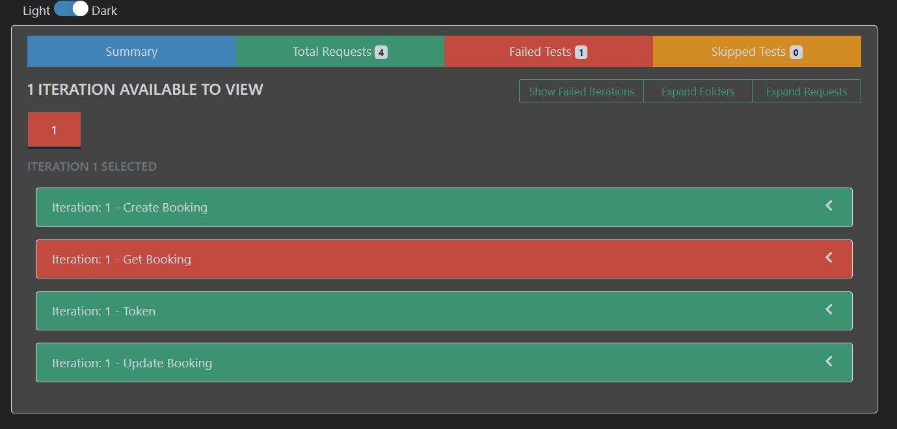

# API Testing of Rest Booking with Newman Report

This project demonstrates the process of automating API testing for the Restful Booker API using Postman and Newman. It involves creating, updating, retrieving, and deleting booking records through API requests. The tests are executed using Postman, and the results are generated as a detailed HTML report using Newman. This repository includes all necessary Postman collections and environment files, along with the setup instructions to run the tests and view the results.

## API Documentation

You can view the complete API documentation [here](https://docs.google.com/document/d/1By2-SYRGB0pn-R45Pk0AHDecpK1oZiTA7nf31Op_r9k/edit?usp=sharing).

## Features:
- **Automated API Testing**: Automated testing of the Restful Booker API for booking creation, retrieval, updating, and deletion.
- **Postman Collection**: Pre-configured Postman collection for various API operations.
- **Dynamic Data Generation**: Utilizes dynamic data generation for first name, last name, total price, check-in, and check-out dates in the API requests.
- **Authentication Token Generation**: Automatic generation of authentication tokens for secure access to the API.
- **Newman HTML Report**: Generate detailed HTML reports for test execution with rich visuals and logs.
- **Cross-environment Testing**: The Postman environment allows testing in different environments such as Development or Production.
- **API Documentation**: Detailed API documentation with request methods, bodies, and expected responses.
- **Screenshots of Test Execution**: Visual evidence of test execution with screenshots to verify the testing process.

## Technology Used:
- **Postman**: API development and testing tool.
- **Newman**: Command-line collection runner for Postman.
- **Newman HTML Reporter**: HTML report generation for Newman test results.

## Prerequisites:
- **Node.js** (Required for running Newman)
- **Newman** (CLI tool for running Postman collections)
- **Newman HTML Reporter** (For generating detailed reports)

## Setup

### 1. Install Postman:
If you haven't already, download and install [Postman](https://www.postman.com/downloads/).

### 2. Clone the Repository:
Clone this repository to your local machine:
```bash
git clone https://github.com/TasfiaZaima/Automated-Testing-of-Rest-Booking-API-with-Newman-Report.git
```

### 3. Import the Postman Collection:
1. Open Postman.
2. Click on the **Import** button.
3. Select the Postman collection file from the cloned repository to import it into Postman.

### 4. Import the Postman Environment:
1. In Postman, click on the gear icon in the top-right corner.
2. Select **Import** and choose the Postman environment file from the cloned repository to import it.

### 5. Install Newman and Required Packages:

#### Install **Newman** globally:
```bash
npm install -g newman
```

#### Install **Newman HTML Reporter** globally:
```bash
npm install -g newman-reporter-htmlextra
```
## Testing

### Test Case Scenarios:

1. **Create New Booking**
   - **Request URL:** `https://restful-booker.herokuapp.com/booking/`
   - **Request Method:** POST
   - **Request Body:**
   ```json
   {
       "firstname": "{{firstName}}",
       "lastname": "{{lastName}}",
       "totalprice": "{{totalPrice}}",
       "depositpaid": "{{depositPaid}}",
       "bookingdates": {
           "checkin": "{{checkin}}",
           "checkout": "{{checkout}}"
       },
       "additionalneeds": "{{additionalNeeds}}"
   }
   ```

2. **Get Booking Details By ID**
   - **Request URL:** `https://restful-booker.herokuapp.com/booking/bookingid`
   - **Request Method:** GET
   - **Response Body:**
   ```json
   {
       "firstname": "D'angelo",
       "lastname": "Feeney",
       "totalprice": 757,
       "depositpaid": true,
       "bookingdates": {
           "checkin": "2024-03-15",
           "checkout": "2024-03-20"
       },
       "additionalneeds": "hard drive"
   }
   ```

3. **Create A Token For Authentication**
   - **Request URL:** `https://restful-booker.herokuapp.com/auth`
   - **Request Method:** POST
   - **Request Body:**
   ```json
   {
       "username": "admin",
       "password": "password123"
   }
   ```

4. **Update the Booking Details**
   - **Request URL:** `https://restful-booker.herokuapp.com/booking/bookingid`
   - **Request Method:** PUT
   - **Request Body:**
   ```json
   {
       "firstname": "{{firstName}}",
       "lastname": "{{lastName}}",
       "totalprice": "{{totalPrice}}",
       "depositpaid": "{{depositPaid}}",
       "bookingdates": {
           "checkin": "{{checkin}}",
           "checkout": "{{checkout}}"
       },
       "additionalneeds": "{{additionalNeeds}}"
   }
   ```

5. **Delete Booking Record**
   - **Request URL:** `https://restful-booker.herokuapp.com/booking/bookingid`
   - **Request Method:** DELETE
   - **Response Body:** None

### 6. Run Command:

#### Run Command for Console:
```bash
newman run Tasfia_Zaima_SQA.postman_collection.json -e Tasfia_Zaima_SQA.postman_environment.json
```

#### Run Command for Report:
```bash
newman run Tasfia_Zaima_SQA.postman_collection.json -e Tasfia_Zaima_SQA.postman_environment.json -r cli,htmlextra
```

## Newman Report Summary

- **HTML Report Generated**

   The report has been generated and stored in the `newman/` directory.

### Screenshots:

- 
- 
- 
- 
- 

---
